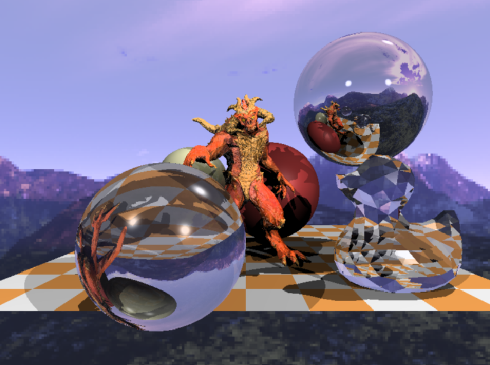

# Mini Raytracing
_这是一个CPU光追渲染器_

[TOC]

## 1. FrameBuffer准备

做点准备工作，搭建个程序框架

```c++
int main() {
    TGAImage frameBuffer(kWidth, kHeight, TGAImage::RGB);
    render(frameBuffer);
    frameBuffer.flip_vertically();
    frameBuffer.write_tga_file(kFrameBufferOutput.c_str());
    return 0;
}
```

`Render`函数是渲染入口，首先随便输出点颜色

```c++
void render(TGAImage& frameBuffer) {
    for (size_t i = 0; i < kWidth; ++i)
        for (size_t j = 0; j < kHeight; ++j)
            frameBuffer.set(i, j, TGAColor(std::round(255.0 * i / kWidth), std::round(255.0 * j / kHeight), 0, 255));
}
```

output:


## 2. 画一个球

光线追踪的渲染过程和光栅化的渲染流程有非常大的不同，具体详见下图：


假想在相机前放置了一个矩形的屏幕，这个矩形按照实际像素切分成一个个小正方，从相机发射一根(或多根)光线依次穿过屏幕的小正方形，计算这根光线经过反射折射到光源最终的颜色，以这个颜色作为该像素的颜色。

1.计算正方形的边长

_灵魂画手预警_


假设相机在坐标原点，屏幕在`z=-1`平面上，已知相机的`FOV`也就是图中`alpha`的角度, 很容易得出屏幕高度`h = 2 * (tan(alpha/2) * 1)`，所以正方形的高度是`2 * tan(alpha / 2) / kHeight `(kHeight是屏幕像素行数)

2.像素坐标到世界坐标的装换

```c++
TGAColor cast_ray(const Vec3f& org, const Vec3f& dir, const std::vector<Sphere>& spheres);
...
    for (size_t i = 0; i < kWidth; ++i)
        for (size_t j = 0; j < kHeight; ++j) {
            const float x = (2 * (i + 0.5) / static_cast<float>(kWidth) - 1) * tan(kFov / 2.f) * kWidth /
                            static_cast<float>(kHeight);
            const float y = -(2 * (j + 0.5) / static_cast<float>(kHeight) - 1) * tan(kFov / 2.f);
            Vec3f dir = Vec3f(x, y, -1).normalize();
            frameBuffer.set(i, j, cast_ray(cameraPos, dir, spheres));
        }
...
```

`x`坐标可以直接通过`(i - kWidth/2) * <像素宽度>`得到，简单化简可得上诉公式，`y`坐标为`-(j * <像素宽度> - tan(alpha / 2))`，以为这里假设光线穿过像素的中心，所以`i`和`j`都要各加`0.5`。

接下来要定义球这个数据结构
```c++
struct Sphere {
    Vec3f center_;
    float radius_;
    Material material_;

    Sphere(const Vec3f& c, const float& r) : center_(c), radius_(r){};
    Sphere(const Vec3f& c, const float& r, const Material& m) : center_(c), radius_(r), material_(m){};

    // dir is normalized
    bool ray_intersect(const Vec3f& org, const Vec3f& dir, float& t0) const {
        Vec3f l = center_ - org;
        float tca = l * dir;
        float d2 = l * l - tca * tca;
        if (d2 > radius_ * radius_) return false;

        float thc = sqrtf(radius_ * radius_ - d2);
        t0 = tca - thc;
        float t1 = tca + thc;
        if (t0 < 0) t0 = t1;
        if (t0 < 0) return false;
        return true;
    }
};
```
`Class Sphere`中`ray_intersect`方法用于检测射线是否碰撞了球体，并返回碰撞距离`t0`。

然后再简单实现下`ray_cast`

```c++
bool scene_intersect(const Vec3f& org, const Vec3f& dir, const std::vector<Sphere>& spheres, Vec3f& hit,
                     Vec3f& hitNormal, Material& material) {
    float sphereDistance = std::numeric_limits<float>::max();
    for (const auto& sphere : spheres) {
        float distance;
        if (sphere.ray_intersect(org, dir, distance) && distance < sphereDistance) {
            sphereDistance = distance;
            hit = org + dir * distance;
            hitNormal = (hit - sphere.center_).normalize();
            material = sphere.material_;
        }
    }
    return sphereDistance < 1000.f;
}

TGAColor cast_ray(const Vec3f& org, const Vec3f& dir, const std::vector<Sphere>& spheres) {
    TGAColor background{51, 179, 204, 255};
    Vec3f hitPoint, hitNormal;
    Material material;

    if (!scene_intersect(org, dir, spheres, hitPoint, hitNormal, material)) {
        return background;
    }
    return material.diffuse_;
}
```

最终得出结果:


## 3. 光照

下一步给在场景中放入点光，点光的加入可以让画面更有层次感,
```c++
struct Light {
    Light(const Vec3f& pos, const float& i) : position_(pos), intensity_(i){};

    Vec3f position_;
    float intensity_;
};
```

我们这里采用[Phong reflection model](https://en.wikipedia.org/wiki/Phong_reflection_model)，光照计算如下：


定义Diffuse部分光照强度=`Normal · LightDir`，实现如下：

```c++
TGAColor cast_ray(const Vec3f& org, const Vec3f& dir, const std::vector<Sphere>& spheres, const std::vector<Light>& lights) {
    TGAColor background{51, 179, 204, 255};
    Vec3f hitPoint, hitNormal;
    Material material;

    if (!scene_intersect(org, dir, spheres, hitPoint, hitNormal, material)) {
        return background;
    }
    float diffuseLightIntensity = 0;
    for (const auto& light : lights) {
        const Vec3f lightDir = (light.position_ - hitPoint).normalize();
        diffuseLightIntensity += light.intensity_ * std::max(0.f, lightDir * hitNormal);
    }
    return material.diffuse_ * diffuseLightIntensity;
}
```

加上Diffuse光照后的结果：


## 4. 高光

在添加高光之前，首先要给`Material`加一个`specularExponent`参数，定义这种材质的镜面指数，以及`albedo`定义反照率。
```c++
struct Material {
    Material() = default;
    Material(const Vec2f& a, const Vec3f& color, const float& spec)
        : albedo_(a), diffuse_(color), specularExponent_(spec) {}
    Vec2f albedo_{1.f, 0.f};
    Vec3f diffuse_;
    float specularExponent_{0.f};
};
```
`albedo_`第一项表示diffuse部分，第二项表示高光部分

高光的强度=`视角反射光线 · LightDir`，代码实现如下
```c++
TGAColor cast_ray(const Vec3f& org, const Vec3f& dir, const std::vector<Sphere>& spheres,
                  const std::vector<Light>& lights) {
    ...
    float diffuseLightIntensity = 0;
    float specularLightIntensity = 0;
    for (const auto& light : lights) {
        const Vec3f lightDir = (light.position_ - hitPoint).normalize();
        diffuseLightIntensity += light.intensity_ * std::max(0.f, lightDir * hitNormal);
        // -reflect(-lightDir, hitNormal) = reflect(lightDir, hitNormal)
        specularLightIntensity +=
            powf(std::max(0.f, reflect(lightDir, hitNormal) * dir), material.specularExponent_) * light.intensity_;
    }
    Vec3f out = material.diffuse_ * diffuseLightIntensity * material.albedo_[0] +
                Vec3f(1.f, 1.f, 1.f) * specularLightIntensity * material.albedo_[1];
    float max = std::max(out[0], std::max(out[1], out[2]));
    if (max > 1.f) out = out * (1 / max);
    return out;
}
```

计算反射光线的算法也很简单:
```c++
Vec3f reflect(const Vec3f& in, const Vec3f& normal) { return in - normal * 2.f * (in * normal); }
```
_简单图像学知识就不展开了_

加入高光之后的画面如下：


## 5. 反射

回顾下已有的代码`cast_ray`方法可以计算场景中一根光线最终的颜色，当渲染类似于镜子，光滑度很高的金属这样的镜面物体时，可以复用这个方法就算镜面的图像。具体的实现如下：
```
...

    const Vec3f reflectDir = reflect(dir, hitNormal).normalize();
    const Vec3f reflectOri = reflectDir * hitNormal < 0 ? hitPoint - hitNormal * kReflectionOffset : hitPoint + hitNormal * kReflectionOffset;
    const Vec3f refectColor = cast_ray(reflectOri, reflectDir, spheres, lights, depth + 1);
...
```

PS: reflectOri这里添加了一个微小的偏移，防止重复打到同一点上

`cast_ray`引入了`depth`的概念，代表目前这条光线经过了几次反射，防止光线无限地反射

最后在`Material`中`albedo`引入第三个分量，代表反射部分

把两个球改成镜面后的画面:


## 6. 折射

与反射类似，折射也可以通过这种方式实现，只不过折射光线不在是以发现做镜面变换得到，而是遵循[Snell's law](https://en.wikipedia.org/wiki/Snell%27s_law)

详细的计算这里不做展开，`Material`中添加'refractiveIndex'参数表示该材质的折射率，以及`albedo`添加第4维分量表示折射部分

```c++
    const Vec3f refractDir = refract(dir, hitNormal, material.refractiveIndex_).normalize();
    const Vec3f refractOri = refractDir * hitNormal < 0 ? hitPoint - hitNormal * kReflectionOffset: hitPoint + hitNormal * kReflectionOffset;
    const Vec3f refractColor = cast_ray(reflectOri, reflectDir, spheres, lights, depth + 1);
```

最终混合得到颜色
```c++
Vec3f out = material.diffuse_ * diffuseLightIntensity * material.albedo_[0] + Vec3f(1.f, 1.f, 1.f) * specularLightIntensity * material.albedo_[1] + refectColor * material.albedo_[2] + refractColor * material.albedo_[3];
```

把一个球改成透镜之后的画面：


## 7. 阴影

这里随便在场景里添加一个地板，在`y = -4`平面
```c++
bool scene_intersect(const Vec3f& ori, const Vec3f& dir, const std::vector<Sphere>& spheres, Vec3f& hit,
                     Vec3f& hitNormal, Material& material) {
    float sphereDistance = std::numeric_limits<float>::max();
    for (const auto& sphere : spheres) {
        float distance;
        if (sphere.ray_intersect(ori, dir, distance) && distance < sphereDistance) {
            sphereDistance = distance;
            hit = ori + dir * distance;
            hitNormal = (hit - sphere.center_).normalize();
            material = sphere.material_;
        }
    }
    float checkerboardDistance = std::numeric_limits<float>::max();
    if (std::fabs(dir.y) > kCheckerboardThreshold) {
        float d = (kCheckerboardPlaneY - ori.y) / dir.y;
        Vec3f point = ori + dir * d;
        if (d > 0 && point.x > kCheckerboardPlaneXMin && point.x < kCheckerboardPlaneXMax &&
            point.z > kCheckerboardPlaneZMin && point.z < kCheckerboardPlaneZMax && d < sphereDistance) {
            checkerboardDistance = d;
            hit = point;
            hitNormal = {0.f, 1.f, 0.f};
            material.diffuse_ = ((static_cast<int>(.5 * hit.x + 1000) + static_cast<int>(.5 * hit.z)) & 1) ? Vec3f{.3f, .3f, .3f}
                                    : Vec3f{.3f, .2f, .1f};
        }
    }
    return std::min(sphereDistance, checkerboardDistance) < kMaxDistance;
}
```

加上地板后的画面如下：


有了地板之后画面还是很平，这里还缺少阴影。

与通常的`Shadow map`解决方案不同，这里可以利用在场景中打射线检测的方式实现阴影。

具体实现如下：
```c++

...
    for (const auto& light : lights) {
        ...
        Vec3f shadowPoint, shadowNormal;
        Material shadowMaterial;
        if (scene_intersect(shadowOri, lightDir, spheres, shadowPoint, shadowNormal, shadowMaterial) &&
            (shadowPoint - shadowOri).norm() < lightDistance)
            continue;
       ...
    }
...

```

在当前点发射射线到点光中心检测，若射线检测到别的物体挡在灯光与当前点中间，则可以忽略这盏灯的影响`continue`

有了阴影后的画面：


## 8. 天空盒

目前当光线碰不到任何物体时会返回一个纯色代表底色
```c++
    if (depth > kMaxReflectionTimes || !scene_intersect(org, dir, spheres,hitPoint, hitNormal, material)) {
        return background;
    }
```

这里定一个`cubmap skybox`作为背景:
```c++
class CubeMap {
   public:
    // Front, Up, Right, Back, Down, Left
    CubeMap(const std::vector<std::string>& maps);

    TGAColor sample(const Vec3f& dir) const;

   private:
    /*
        front   up  right    back    down   left
        +x      +y  +z      -x      -y      -z
        0       1   2       3       4       5
    */
    static size_t get_face(const Vec3f& dir) {
        size_t m = 0;
        for (size_t i = 1; i < 3; ++i)
            if (std::fabs(dir[i]) > std::fabs(dir[m])) m = i;
        return m + (dir[m] > 0 ? 0 : 3);
    }

   static Vec2f get_uv(const size_t& index, const Vec3f& dir);

    std::vector<TGAImage> maps_;
};
```

在光线碰不到任何物体时，根据方向在`cubemap`上进行采样获取颜色:
```c++
    if (depth > kMaxReflectionTimes || !scene_intersect(org, dir, spheres,hitPoint, hitNormal, material)) {
        return skyBox.sample(dir).to_linear();
    }
```

添加了天空盒之后的画面:


## 9. 渲染模型

到目前为止都是渲染的球体这样的简单模型，其实利用已有的这个渲染器也是可以渲染一般的模型，只不过还需要补充亿点点细节:

1. 模型/贴图加载；
2. UV空间法线贴图到模型空间的转换；
3. 模型Transform的管理；
4. 模型Mesh的射线碰撞；

因为都不是重点这里就不展开说明了,具体实现可以参考代码(懒！

其中第4点特别说明下，这里采用了一个优化策略：首先射线与模型的boundingBox进行碰撞检测，若有碰撞才去跟mesh进行检测。

目前画面如下：



_好像还有点问题，我再修修_

## 10. 多线程优化

 在加入模型渲染之后，消耗的时间成倍的增长，急需优化开发调试效率。其实可以注意到打在屏幕上的射线每一根的计算都是彼此独立的，而且不会修改场景中的物体，这样就可以很方便地进行多线程并行优化。实现如下：

 ```
 void ConcurrentModule::parallelFor(int num, std::function<void(int)> body) {
    const int workerNum = std::min(num, getInstance().maxWorkerThreads_);
    if (workerNum == 0) {
        // no threads, just do it and return
        for (int index = 0; index < num; ++index) {
            body(index);
        }
        return;
    }

    std::vector<std::future<void>> tasksFuture;
    tasksFuture.reserve(num);
    int index = 0;
    while (index < num) {
        const int start = index;
        for (int i = 0; i < workerNum; ++i) {
            tasksFuture.emplace_back(std::async(std::launch::async, body, index));
            ++index;
            if (index >= num) break;
        }
        for (int i = start; i < index; ++i) tasksFuture[i].get();
    }
}
```

然后让每一根光线的计算并行:

```c++
  ConcurrentModule::parallelFor(
        kWidth * kHeight, [&cameraPos, &spheres, &models, &lights, &frameBuffer](const auto& index) {
            const int i = index / kHeight;
            const int j = index % kHeight;
            const float x = (2 * (i + 0.5) / static_cast<float>(kWidth) - 1) * tan(kFov / 2.f) * kWidth /
                            static_cast<float>(kHeight);
            const float y = -(2 * (j + 0.5) / static_cast<float>(kHeight) - 1) * tan(kFov / 2.f);
            const Vec3f dir = Vec3f(x, y, -1).normalize();
            frameBuffer.set(i, j, cast_ray(cameraPos, dir, spheres, models, lights));
            std::cout << "Ray tracing (" << i << " , " << j << ")..Done" << std::endl;
        });
```

目前在我的i5破电脑上能跑到15分钟一帧，后面还有优化思路，准备实现下再看看。
